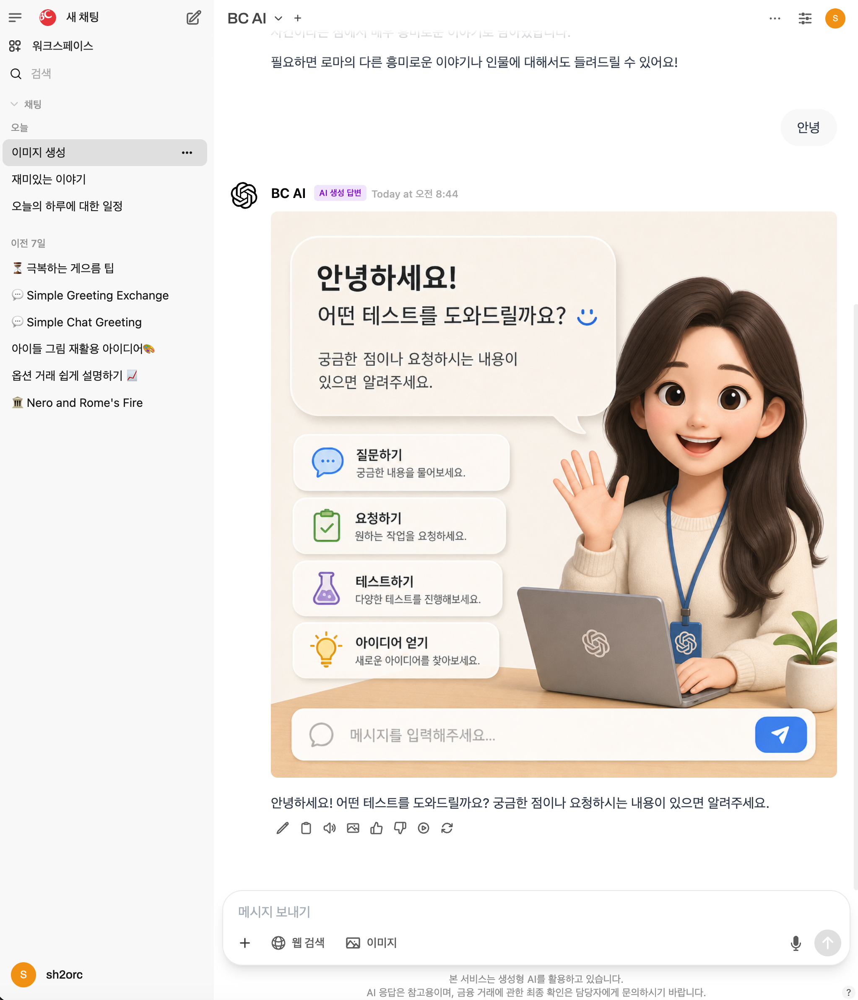

<div align="center">

# BCGPT WebUI

**Enterprise-Grade Self-Hosted AI Platform with Advanced Agent Orchestration**

[](LICENSE)


</div>

---

## About

**BCGPT WebUI** is an enterprise-grade, self-hosted AI platform powered by **BC Card's AI Native technologies** — a suite of production-hardened AI capabilities developed and battle-tested at one of Korea's largest financial companies. It features a built-in multi-agent orchestration engine, 12-module advanced RAG pipeline (HyDE, query expansion, step-back prompting, RRF fusion, multi-hop retrieval, CRAG, document grading, evidence reconciliation), quality assurance pipeline, and 18 search provider integrations. Designed from the ground up for production reliability, it supports vLLM, Ollama, OpenAI, Azure, Claude, Gemini, and any OpenAI-compatible API — with full RAG capabilities, reasoning model support (o1/o3/o4/GPT-5), and DAG-based agent workflows.

Originally forked from [Open WebUI](https://github.com/open-webui/open-webui) v0.6.0, BCGPT WebUI has since been **completely rebuilt** — frontend rewritten in Svelte 5 with Tailwind CSS 4, backend restructured as the `bcgpt` Python package, and an entirely new agent module, RAG pipeline, and quality assurance system added from scratch. Today, virtually every layer has been replaced with production-grade implementations — making BCGPT WebUI a fundamentally different platform, not just a fork.

### BC Card's AI Native Technologies

BCGPT WebUI is where BC Card's **AI Native** strategy meets the open-source community. Through years of operating AI services at enterprise scale in the financial sector, BC Card has developed a set of core AI technologies — from advanced RAG pipelines and multi-agent orchestration to quality assurance and regulatory compliance — that go far beyond what typical LLM wrappers provide. These are not theoretical designs or prototype features. They are technologies that process real financial workloads, serve real users under strict SLAs, and comply with Korea's AI Basic Act and financial sector regulations.

BCGPT WebUI applies these AI Native technologies end-to-end:

| Technology Area            | BC Card AI Native Capability                                                                                                           |
| -------------------------- | -------------------------------------------------------------------------------------------------------------------------------------- |
| **Advanced RAG**           | 12-module production pipeline — HyDE, query expansion, step-back, RRF fusion, rule-based + LLM reranking, CRAG, doc grading, multi-hop |
| **Agent Orchestration**    | Multi-agent coordination (Sequential, Parallel, MoA, Debate, Voting, Consensus) with DAG workflow engine                               |
| **Quality Assurance**      | 4-stage answer verification — claim decomposition, grounding, document grading, entailment scoring                                     |
| **Korean AI Optimization** | Korean-optimized embeddings (BAAI/bge-m3), reranker (BAAI/bge-reranker-v2-m3), Korean NLP normalization, Naver search                  |
| **Compliance & Security**  | Korean AI Basic Act compliance, FSC financial AI guidelines, RBAC, audit logging, CSRF protection                                      |
| **Reasoning Models**       | Native support for OpenAI reasoning models (o1, o3, o4, GPT-5) with automatic payload adaptation                                       |

> **Why open source?** We believe that powerful AI infrastructure should be accessible to everyone — not locked behind proprietary licenses. BC Card's internal open-moai platform proved that AI Native technologies — production-grade RAG, multi-agent orchestration, quality assurance — can dramatically improve AI answer quality at enterprise scale. By contributing these technologies to BCGPT WebUI under an open license, we enable anyone to access the same AI capabilities that power real financial services. Whether you're a startup building an AI-powered product, an enterprise outfitting internal services, or a researcher experimenting with agent architectures, BCGPT WebUI gives you the freedom to use, modify, and extend the platform without restrictions. Fork it, customize it, make it yours.



---

## What Makes BCGPT Different

Open WebUI served as a useful starting point, but its architecture — Svelte 4, Tailwind 3, basic function calling, no quality assurance — reflects a hobby-project mindset that falls short of enterprise demands. BCGPT WebUI rebuilt it from the ground up with **production reliability, advanced agent orchestration, and AI Native quality assurance**. Here's what sets BCGPT apart:

### Fundamentally Rebuilt Architecture

| Layer              | Open WebUI (0.6.0)     | BCGPT WebUI                                                                                                                                                    |
| ------------------ | ---------------------- | -------------------------------------------------------------------------------------------------------------------------------------------------------------- |
| Frontend Framework | Svelte 4               | **Svelte 5** (runes: `$state`, `$derived`, `$effect`, `$props`)                                                                                                |
| CSS Framework      | Tailwind CSS 3         | **Tailwind CSS 4** (`@import 'tailwindcss'` + PostCSS)                                                                                                         |
| Build Tool         | Vite 5                 | **Vite 6**                                                                                                                                                     |
| Backend Package    | `open_webui`           | **`bcgpt`** — fully restructured with `agent/`, `providers/`, `utils/`                                                                                         |
| Agent System       | Basic function calling | **Full multi-agent orchestration** with DAG workflows                                                                                                          |
| Quality Assurance  | None                   | **4-stage quality pipeline** (claim verification, grounding, document grading, entailment scoring)                                                             |
| RAG Pipeline       | Basic vector search    | **12-module production RAG** (HyDE, query expansion, step-back, RRF fusion, rule-based + LLM reranking, CRAG, doc grading, evidence reconciliation, multi-hop) |
| Search Integration | 10 providers           | **18 providers** including Naver, Exa, Kagi, Perplexity, Mojeek, SerpApi, Bocha                                                                                |
| Model Support      | Standard OpenAI/Ollama | Standard + **reasoning models** (o1, o3, o4, GPT-5) with automatic payload adaptation                                                                          |
| Security           | Basic auth             | **Enterprise-grade** — CSRF, RBAC, audit logging, SSRF protection, account lockout, 7-layer AI security scanner pipeline, emergency stop                       |
| Compliance         | None                   | **Korean AI Basic Act + FSC financial AI guidelines**                                                                                                          |
| License            | BSD-3 (brand locked)   | **Apache 2.0** for all new code — modify freely                                                                                                                |

### Advanced Agent System

BCGPT WebUI features a purpose-built **Agent Module** that goes far beyond simple function calling:

- **Multi-Agent Orchestration** — Six coordination strategies for complex tasks:
  - `Sequential` — Agents process in chain, each building on the previous output
  - `Parallel` — Independent agents run concurrently, results merged
  - `Mixture of Agents (MoA)` — Multiple agents propose, aggregator synthesizes
  - `Debate` — Agents argue opposing viewpoints, judge resolves
  - `Voting` — Democratic consensus across multiple model responses
  - `Consensus` — Iterative refinement until agents converge

- **DAG Workflow Engine** — Define complex agent workflows as directed acyclic graphs:
  - Topological layer execution with concurrent sibling nodes
  - Per-node error strategies (stop / continue / retry / fallback)
  - Built-in node types: RAG search, web search, LLM call, tool call
  - Extensible node registry for custom handlers

- **ReAct Tool Loop** — Autonomous N-hop reasoning loop:
  - Models learn a JSON tool-call protocol via system prompts
  - Supports both synthetic tool calls and native function calling
  - Automatic tool chaining across hops with safety caps

- **Quality Pipeline** — Four-stage answer verification:
  - **Claim Decomposition** — Breaks responses into verifiable claims
  - **Answer Grounding** — Checks if claims are supported by retrieved context
  - **Document Grading** — Assesses source document relevance and quality
  - **Entailment Scoring** — Measures logical consistency between claims and evidence
  - Weighted overall quality score (grounding 40%, document quality 20%, entailment 40%)

### Extended Web Search (18 Providers)

BCGPT WebUI extends web search with providers tailored for global and Korean markets:

| Provider     | Region Focus                                          |
| ------------ | ----------------------------------------------------- |
| **Naver**    | Korean web search (news, blog, web, cafe, kin, local) |
| Google PSE   | Global                                                |
| SearXNG      | Self-hosted meta-search                               |
| Brave Search | Privacy-focused global                                |
| DuckDuckGo   | Privacy-focused global                                |
| Bing         | Global                                                |
| Exa          | AI-optimized semantic search                          |
| Tavily       | AI research                                           |
| Serper       | Google SERP API                                       |
| Serpstack    | Google SERP API                                       |
| SearchApi    | Multi-engine                                          |
| Serply       | SERP proxy                                            |
| Kagi         | Premium search                                        |
| Perplexity   | AI-powered search                                     |
| Mojeek       | Independent index                                     |
| Jina Search  | Neural search                                         |
| **SerpApi**  | Google SERP API (structured data)                     |
| **Bocha**    | AI-powered search (Chinese market)                    |

### Reasoning Model Support

Built-in adapter for OpenAI's reasoning model family:

- **Automatic detection** — Identifies o1, o3, o4-mini, and GPT-5 models
- **Payload transformation** — Strips incompatible sampling params (`temperature`, `top_p`) that reasoning models reject
- **Reasoning effort control** — Supports `reasoning_effort` parameter for fine-grained control over reasoning depth

### Enterprise Security & Regulatory Compliance

BCGPT WebUI is designed to meet the compliance requirements of Korea's financial sector. Deployed at BC Card, the platform implements safeguards aligned with the following regulatory frameworks:

#### Korean AI Basic Act (인공지능 기본법, Law No. 20676)

Effective January 22, 2026 — the Framework Act on the Development of Artificial Intelligence and Establishment of Trust mandates transparency, safety, and accountability for AI services:

- **AI Transparency Banner** — Configurable disclosure that responses are AI-generated, satisfying Article 31 content labeling requirements for generative AI services
- **Advance User Notification** — Users are informed they are interacting with AI, meeting the advance notice obligation for generative AI operators
- **Emergency Stop** — One-click system-wide halt of all AI interactions, satisfying the emergency control requirement for high-impact AI (Article 34)
- **Quality Pipeline** — Four-stage answer verification (claim grounding, document grading, entailment scoring) supports the safety and reliability measures required under Articles 33-35

#### Financial Sector AI Guidelines (금융분야 AI 가이드라인)

Aligned with the FSC's Seven Principles for AI in Finance (금융 AI 7대 원칙, December 2024) and the integrated financial AI guidelines (expected April 2026):

- **Governance** — CEO-level AI ethics committee structure; independent risk management separate from AI development
- **Human Oversight** — Clear employee accountability with differentiated intervention rules by risk level
- **Reliability** — Regular model performance management; fairness and bias testing; explainability to stakeholders
- **Financial Stability** — Emergency controls and backup model capability; supervisory authority reporting
- **Good Faith** — Advance notification of AI use to all customers; error reporting; consumer choice protection

#### Security Controls

- **CSRF protection** on all state-changing endpoints
- **Role-Based Access Control (RBAC)** with granular permissions
- **User group management** for organizational hierarchies
- **Security event logging** for audit trails
- **Emergency Stop** — One-click kill switch to immediately halt all AI interactions system-wide
- **AI Security Scanner Pipeline** — Seven-layer defense against AI-specific threats:
  - **Prompt Injection Scanner** — Detects and blocks injection attempts in user inputs
  - **Jailbreak Scanner** — Identifies jailbreak and bypass attempts
  - **PII Scanner** — Detects personal identifiable information with configurable masking modes
  - **Toxicity Scanner** — Filters harmful content with customizable word lists
  - **Secrets Scanner** — Prevents leakage of API keys, tokens, and credentials
  - **Output Filter** — Scans and filters model responses for safety
  - **LLM Scanner** — LLM-based classification for nuanced threat detection

---

## Key Features

### Core Chat

- **Effortless Setup** — Docker, Kubernetes (kubectl, kustomize, helm), or pip install
- **Multi-Provider LLM Support** — Ollama, OpenAI, Azure, Claude, Gemini, and any OpenAI-compatible API (LMStudio, GroqCloud, Mistral, OpenRouter)
- **User Memories** — Persistent personal memories stored in vector DB for contextual personalization across conversations
- **Responsive Design** — Seamless experience across Desktop, Laptop, and Mobile
- **Progressive Web App (PWA)** — Native app-like experience on mobile with installable app manifest
- **Full Markdown & LaTeX** — Rich rendering for technical content
- **Voice & Video Call** — Hands-free communication with integrated STT/TTS

### Knowledge & Retrieval

BC Card's internal **open-moai** platform was designed to deliver production-grade AI services at enterprise scale in Korea's financial sector. Through BCGPT WebUI, we are contributing these battle-tested RAG technologies back to the open-source community — so that everyone, not just large enterprises, can benefit from the same retrieval quality that powers real financial AI services.

#### Production RAG Pipeline

The RAG pipeline in BCGPT WebUI implements the full retrieval quality stack from BC Card's open-moai, organized into four stages:

**Pre-Retrieval** — Query understanding before search:

- **HyDE (Hypothetical Document Embeddings)** — LLM generates a hypothetical answer document, embeds it, and uses it for retrieval instead of the raw query. Includes Korean/English normalization (code fence removal, length capping).
- **Query Expansion** — LLM generates N alternative phrasings of the same question, deduplicates them, and searches across all variants.
- **Step-Back Prompting** — Detects Korean/English questions and generates a broader, more abstract version to improve recall on conceptual queries.

**Retrieval** — Multi-signal search:

- **Hybrid Search + RRF Fusion** — Combines BM25 (keyword) and vector (semantic) search results using Reciprocal Rank Fusion (`1/(k+rank+1)`), with configurable per-track weights and top-K selection. Replaces the naive EnsembleRetriever with precise rank-based scoring.
- **Multi-Hop Retrieval** — Automatically detects complex multi-part questions, decomposes them into ordered sub-queries via LLM (with dependency tracking), retrieves for each, and merges results.

**Post-Retrieval** — Result quality refinement:

- **Rule-Based Reranking** — 5-component heuristic scoring: exact match, title hit, TF similarity, position bonus, coverage ratio.
- **LLM Reranking** — LLM scores document relevance on a 1-10 scale with fallback parsing for robust JSON extraction.
- **CRAG Quality Assessment** — Composite retrieval quality score (similarity 45%, keyword overlap 25%, coverage 15%, diversity 15%) with sufficient/partial/insufficient verdicts.
- **Document Grading** — Per-document relevance assessment via heuristic + LLM grading (correct / ambiguous / incorrect), filtering out incorrect documents.

**Advanced** — Evidence-level processing:

- **Evidence Reconciliation** — Jaccard-based redundancy detection, topic grouping, and numeric/negation conflict identification across retrieved documents.

#### Agent-Level RAG Configuration

Each agent can override global RAG settings independently:

| Setting         | Description                          | Default |
| --------------- | ------------------------------------ | ------- |
| `k`             | Number of documents to retrieve      | 4       |
| `r`             | Reranker top-K                       | 4       |
| `hybrid`        | Enable hybrid (BM25 + vector) search | off     |
| `k_reranker`    | Documents to pass through reranker   | off     |
| `query_rewrite` | Enable query rewrite                 | off     |
| `hyde`          | Enable HyDE                          | off     |
| `rag_template`  | Custom RAG prompt template           | default |

#### RAG Management

- **Knowledge Bases** — Create, configure, and manage document collections with access control
- **Vector DB Dashboard** — Real-time monitoring dashboard showing embedding model info (engine + model), connection status, cluster health, total documents/vectors, and per-collection statistics
- **Collection Management** — Browse, inspect, create, and delete Qdrant collections directly from the admin UI
- **Collection Detail Views** — Full document listing and metadata for each collection
- **Embedding Engine Switching** — Dynamically switch between Local (Sentence-Transformers), Ollama, and OpenAI embedding engines from the admin UI without restart
- **Local RAG Integration** — Upload documents directly or add to your library, query with `#` command
- **Web Search for RAG** — 18 search providers with results injected into conversations
- **Web Browsing** — Fetch and incorporate web content via `#` + URL

#### RAG Configuration Environment Variables

All advanced RAG features are **disabled by default** and can be enabled individually via environment variables:

| Variable                              | Description                    | Default |
| ------------------------------------- | ------------------------------ | ------- |
| `RAG_HYDE_ENABLED`                    | Enable HyDE                    | `false` |
| `RAG_HYDE_MODEL`                      | LLM model for HyDE generation  | —       |
| `RAG_QUERY_EXPANSION_ENABLED`         | Enable query expansion         | `false` |
| `RAG_QUERY_EXPANSION_N`               | Number of expanded queries     | `3`     |
| `RAG_STEP_BACK_ENABLED`               | Enable step-back prompting     | `false` |
| `RAG_RRF_K`                           | RRF constant k                 | `60`    |
| `RAG_RULE_BASED_RERANKING_ENABLED`    | Enable rule-based reranking    | `false` |
| `RAG_LLM_RERANKING_ENABLED`           | Enable LLM reranking           | `false` |
| `RAG_CRAG_ENABLED`                    | Enable CRAG quality assessment | `false` |
| `RAG_DOC_GRADING_ENABLED`             | Enable document grading        | `false` |
| `RAG_EVIDENCE_RECONCILIATION_ENABLED` | Enable evidence reconciliation | `false` |
| `RAG_MULTI_HOP_ENABLED`               | Enable multi-hop retrieval     | `false` |
| `RAG_MULTI_QUERY_WEIGHT`              | Weight for multi-query results | `0.5`   |

#### Embedding Engine Support

BCGPT WebUI supports multiple embedding backends that can be switched dynamically from the admin UI:

| Engine                            | Description                                                   | Requirements                    |
| --------------------------------- | ------------------------------------------------------------- | ------------------------------- |
| **Local (Sentence-Transformers)** | Default. Uses locally downloaded sentence-transformer models  | No external API needed          |
| **Ollama**                        | Uses Ollama's embedding endpoint                              | Running Ollama instance         |
| **OpenAI**                        | Uses OpenAI embedding models (e.g., `text-embedding-3-small`) | `OPENAI_API_KEY`                |
| **OpenAI-compatible**             | Any API that follows the OpenAI embeddings format             | Configurable base URL + API key |

### Creation & Automation

- **Model Builder** — Create custom Ollama models, characters, and agents via Web UI
- **Python Function Calling** — Built-in code editor for BYOF (Bring Your Own Function) tools
- **Image Generation** — AUTOMATIC1111, ComfyUI (local), or DALL-E (cloud)
- **Many Models Conversations** — Chat with multiple models simultaneously
- **Agent Workflows** — Define and run multi-step agent pipelines with DAG orchestration
- **Workspace** — Centralized management for agents, functions, knowledge bases, prompts, and tools
- **Evaluations** — Arena mode with leaderboard, user feedback collection, and model comparison

### Administration & Compliance

- **Role-Based Access Control** — Fine-grained permissions and user group management
- **Multilingual (i18n)** — Full internationalization support with 53 locales and community translations
- **Security Scanner Pipeline** — 7-layer AI threat defense (prompt injection, jailbreak, PII, toxicity, secrets, output filter, LLM scanner) with emergency stop
- **Audit Dashboard** — Real-time monitoring dashboard with event statistics, severity breakdown, and compliance summary
- **Audit Logs** — Searchable, filterable audit log viewer with pagination and time-range filtering
- **Personal Data Tracking** — Dedicated view for personal data access records with subject and action details
- **Anomaly Detection** — Automated detection of suspicious activities with severity classification (critical, high, medium, low)
- **Audit Settings** — Configurable logging levels, retention policies, and one-click purge controls
- **AI Transparency** — Configurable disclosure banners for AI-generated content (AI Basic Act Article 31)
- **Regulatory Compliance** — Aligned with Korean AI Basic Act (Law No. 20676) and FSC financial AI guidelines

---

## How to Install

### Installation via Python pip

Requires **Python 3.11+**.

```bash
pip install bcgpt
bcgpt serve
```

Access at [http://localhost:8090](http://localhost:8090)

### Docker Compose (Recommended)

Choose the configuration that fits your deployment:

| File                                | Use Case                           | Services                 |
| ----------------------------------- | ---------------------------------- | ------------------------ |
| `docker-compose.yml`                | All-in-one with Ollama             | BCGPT + Ollama           |
| `docker-compose.without-ollama.yml` | Use external LLM APIs              | BCGPT only               |
| `docker-compose.with-db.yml`        | Production with PostgreSQL + Redis | BCGPT + Postgres + Redis |
| `docker-compose.dev.yml`            | Development with hot reload        | Frontend + Backend       |

#### All-in-One (BCGPT + Ollama)

```bash
docker compose up -d
```

Access at [http://localhost:8090](http://localhost:8090). Ollama runs internally — no separate setup needed.

> [!TIP]
> For GPU support, uncomment the `deploy.resources.reservations.devices` section in `docker-compose.yml`.
> Requires [Nvidia Container Toolkit](https://docs.nvidia.com/dgx/nvidia-container-runtime-upgrade/).

#### Standalone (External LLM APIs)

```bash
# With OpenAI
OPENAI_API_KEY=your_key docker compose -f docker-compose.without-ollama.yml up -d

# With remote Ollama
OLLAMA_BASE_URL=https://your-ollama-server docker compose -f docker-compose.without-ollama.yml up -d
```

#### Production (PostgreSQL + Redis)

```bash
# Change default passwords!
POSTGRES_PASSWORD=your_secure_password docker compose -f docker-compose.with-db.yml up -d
```

> [!WARNING]
> Change `POSTGRES_PASSWORD` before deploying to production. The default credentials are for local development only.

#### Development (Hot Reload)

```bash
docker compose -f docker-compose.dev.yml up
```

Frontend runs at [http://localhost:5173](http://localhost:5173) (Vite dev server with HMR).  
Backend runs at [http://localhost:8090](http://localhost:8090) (uvicorn with `--reload`).

### Docker Run (Manual)

> [!WARNING]
> Always include `-v bcgpt:/app/backend/data` to persist your database.

```bash
# Build the image
docker build -t bcgpt .

# Run standalone
docker run -d -p 8090:8090 \
  -v bcgpt:/app/backend/data \
  --name bcgpt --restart always \
  bcgpt

# With OpenAI API
docker run -d -p 8090:8090 \
  -e OPENAI_API_KEY=your_key \
  -v bcgpt:/app/backend/data \
  --name bcgpt --restart always \
  bcgpt

# Connect to host Ollama
docker run -d -p 8090:8090 \
  --add-host=host.docker.internal:host-gateway \
  -e OLLAMA_BASE_URL=http://host.docker.internal:11434 \
  -v bcgpt:/app/backend/data \
  --name bcgpt --restart always \
  bcgpt
```

### Troubleshooting

If the container can't reach Ollama at `127.0.0.1:11434`, use `--network=host`:

```bash
docker run -d --network=host \
  -v bcgpt:/app/backend/data \
  -e OLLAMA_BASE_URL=http://127.0.0.1:11434 \
  --name bcgpt --restart always \
  bcgpt
```

### Keeping Docker Up-to-Date

```bash
docker compose pull && docker compose up -d
```

### Offline Mode

```bash
export HF_HUB_OFFLINE=1
```

---

## Tech Stack

| Category | Technology   | Version     |
| -------- | ------------ | ----------- |
| Frontend | Svelte       | 5.x (runes) |
| Frontend | SvelteKit    | 2.61        |
| Frontend | Tailwind CSS | 4.x         |
| Frontend | Vite         | 6.x         |
| Frontend | TypeScript   | 5.9         |
| Backend  | Python       | 3.11+       |
| Backend  | FastAPI      | 0.136       |
| Backend  | Pydantic     | 2.13        |
| Backend  | LangChain    | 1.3.x       |
| Testing  | Vitest       | 4.x         |
| Testing  | Cypress      | 15.x        |
| Linting  | ESLint       | 10.x        |
| Linting  | Ruff         | Python      |

---

## Support

Questions, suggestions, or need assistance? [Open an issue](https://github.com/bccard-ai/bcgpt-webui/issues) or reach out to us at **seen@bccard.com** — we'd love to hear from you.

## Acknowledgments

BCGPT WebUI originated as a fork of [Open WebUI](https://github.com/open-webui/open-webui) v0.6.0 by [Timothy Jaeryang Baek](https://github.com/tjbck). While the codebase has been almost entirely rewritten, we gratefully acknowledge Open WebUI's role as the starting point of this project.

The advanced RAG pipeline (HyDE, query expansion, step-back prompting, RRF fusion, rule-based + LLM reranking, CRAG, document grading, evidence reconciliation, multi-hop retrieval) was developed for BC Card's internal **open-moai** platform and is contributed to the open-source community under Apache 2.0 through BCGPT WebUI — so that individuals, startups, and organizations of any size can access the same production-grade retrieval quality that powers enterprise financial AI services.

## License

BCGPT WebUI uses a **dual-license** structure designed to maximize your freedom:

### BC Card's Code — Apache License 2.0

All new code, modifications, and additions made by BC Card — including the advanced RAG pipeline, agent orchestration, quality assurance, Korean AI optimization, compliance features, and the entire restructured `bcgpt` backend — are licensed under the **[Apache License 2.0](LICENSE)**.

This means you can:

- ✅ **Use** — Run for any purpose, commercial or otherwise
- ✅ **Modify** — Change, adapt, and customize to your needs without restriction
- ✅ **Distribute** — Share original or modified versions
- ✅ **Rebrand** — Use under your own brand name for your own deployments
- ✅ **Patent grant** — Automatic patent license from BC Card contributors

No brand lock-in. No attribution requirements beyond the license notice. No restrictions on how you use it.

### Original Open WebUI Code — BSD 3-Clause License

The original code from [Open WebUI](https://github.com/open-webui/open-webui) v0.6.0 by Timothy Jaeryang Baek retains its **BSD 3-Clause License**. This applies only to the portions that were not rewritten by BC Card. Those components retain their original copyright and license notices — you cannot remove the original attribution from those specific files.

### In Practice

The vast majority of BCGPT WebUI's codebase — the agent module, RAG pipeline, quality system, Korean optimizations, compliance controls, and all architectural improvements — is Apache 2.0. Fork it, rebrand it, ship it. It's yours.

See the [LICENSE](LICENSE) and [NOTICE](NOTICE) files for full details.

Copyright 2026 BC Card
