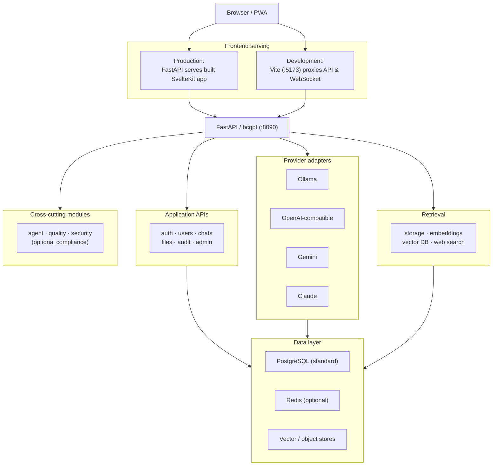

<div align="center">

# BCGPT WebUI

**A self-hosted AI workspace for chat, retrieval, agents, and governance**

[](LICENSE)

**Languages**: [English](README.md) | [한국어](README_KR.md)

</div>


## Overview

BCGPT WebUI is a self-hosted web application for working with large language models. It combines a SvelteKit frontend with a FastAPI backend and supports local Ollama models, OpenAI-compatible APIs, Gemini, and Claude connections. The application includes chat, knowledge bases and retrieval, web search, workspace assets, agent workflows, administration, audit views, and optional governance features.

It began from Open WebUI v0.6.0 and is now maintained as the `bcgpt` Python package and a Svelte 5 application. See [CHANGELOG.md](CHANGELOG.md) for release history and [NOTICE](NOTICE) for upstream notices.

> [!IMPORTANT]
> BCGPT WebUI is software, not a compliance certification or a guarantee of model accuracy. Advanced retrieval, agent, security, FinOps, and compliance capabilities must be enabled, configured, tested, and operated for the deployment where they are used. Many are off by default.

## Contents

- [What is included](#what-is-included)
- [Quick start](#quick-start)
- [Deployment options](#deployment-options)
- [Configuration and operations](#configuration-and-operations)
- [Development](#development)
- [Architecture](#architecture)
- [Testing and quality checks](#testing-and-quality-checks)
- [Security policy](#security-policy)

## What is included

### Chat and workspace

- Multi-provider chat with streaming responses, Markdown/LaTeX rendering, conversation history, folders, tags, shared links, channels, memories, prompt templates, file uploads, and PWA assets.
- Server-side providers for Ollama, OpenAI-compatible APIs, Gemini, and Claude. An OpenAI-compatible endpoint can be used for compatible gateways and model servers.
- Admin and workspace screens for model definitions, knowledge bases, prompts, tools, functions, users, groups, connections, audit data, evaluations, and RAG management.
- Image, audio, task, pipeline, and model-management API surfaces where their respective providers and settings are configured.

### Knowledge, retrieval, and web search

- File and URL ingestion, knowledge-base management, hybrid retrieval, configurable embedding and reranking models, and support for Qdrant, Milvus, pgvector, OpenSearch, and Elasticsearch vector stores.
- Optional retrieval components include HyDE, query expansion, step-back prompting, reciprocal-rank fusion, rule-based and LLM reranking, CRAG, document grading, evidence reconciliation, multi-hop retrieval, parent/child chunking, contextual retrieval, semantic caching, cross-encoder reranking, GraphRAG, MMR, ingestion quality scoring, and column profiling.
- Web-search adapters for Bing, Bocha, Brave, DuckDuckGo, Exa, Google Programmable Search, Jina, Kagi, Mojeek, Naver, Perplexity, SearchAPI, SearXNG, SerpApi, Serper, Serply, Serpstack, and Tavily. Provider credentials and the `ENABLE_RAG_WEB_SEARCH` switch are required before web search can be used.

### Agents and quality controls

- Three model autonomy levels: `suggest`, `assistant`, and `operator`. The operator level uses a bounded ReAct-style tool loop.
- A DAG workflow engine with ten node types: user input, RAG search, web search, context merge, conditional, LLM call, API call, text processor, PII processor, and response. Nodes support stop, continue, retry, and fallback error strategies.
- Multi-agent patterns: sequential, parallel, debate, consensus, voting, mixture of agents (MoA), and council.
- Optional answer-quality stages for claim decomposition, grounding, document grading, entailment scoring, citation auditing, and hallucination detection.

`MULTI_AGENT_ENABLED` and `AGENT_QUALITY_PIPELINE_ENABLED` default to `false`. The workflow engine is enabled by default, but its behavior still depends on the configured model, tools, retrieval, and web-search services. The implementation details and API routes are documented in [backend/bcgpt/agent/README.md](backend/bcgpt/agent/README.md).

### Identity, security, and governance

- Authentication, user roles, groups, API keys, OAuth/OIDC, LDAP, trusted-header SSO, TOTP MFA, RS256/JWKS JWT signing, and SCIM 2.0 provisioning are present in the codebase. Individual integrations are configuration-dependent.
- CSRF protection, baseline security headers, rate limiting, audit logging, file-signature validation, SSRF defenses for outbound fetching, and configurable content and model guardrails are available.
- Optional controls include token/cost tracking and budgets, chat retention/anonymization, AI-interaction audit records, AI transparency messaging, emergency stop, SIEM webhook forwarding, and a compliance module for model inventory, impact assessments, approval gates, incidents, fairness tests, RAG provenance, data-subject requests, and vendor records.

Do not enable a control merely because it exists. Review its settings, data-retention implications, external dependencies, and authorization model first. In particular, tool/function code executes with the server process's privileges; by default only administrators may author it. Do not set `TOOLS_ALLOW_NON_ADMIN_CODE=true` without appropriate operating-system or container isolation.

## Quick start

The quickest local deployment starts BCGPT WebUI and Ollama together. Docker Desktop (or Docker Engine) with the Compose v2 plugin is required.

```bash
git clone https://github.com/bccard-ai/bcgpt-webui.git
cd bcgpt-webui

# Keep this value stable. Changing it invalidates existing sessions.
export BCGPT_SECRET_KEY="$(python3 -c 'import secrets; print(secrets.token_urlsafe(32))')"

docker compose up -d --build
curl --fail http://localhost:8090/healthz
```

Open <http://localhost:8090>, complete the initial onboarding flow, and configure a model. The bundled Ollama service does not automatically download a model; pull one explicitly, then refresh the model list in the UI:

```bash
docker exec -it ollama ollama pull <model-name>
```

The named Docker volumes `bcgpt-data` and `ollama-data` retain application data and Ollama models. This all-in-one quick start is a local convenience profile; use the PostgreSQL profile below as the standard database deployment baseline. Stopping or recreating the containers does not remove these volumes unless you explicitly remove them.

## Deployment options

### Docker Compose files

| File                                                                   | Intended use                                       | Services                       |
| ---------------------------------------------------------------------- | -------------------------------------------------- | ------------------------------ |
| [docker-compose.yml](docker-compose.yml)                               | Local all-in-one deployment                        | BCGPT WebUI, Ollama            |
| [docker-compose.without-ollama.yml](docker-compose.without-ollama.yml) | External model provider or remote Ollama           | BCGPT WebUI                    |
| [docker-compose.with-db.yml](docker-compose.with-db.yml)               | Starting point for PostgreSQL and Redis deployment | BCGPT WebUI, PostgreSQL, Redis |
| [docker-compose.dev.yml](docker-compose.dev.yml)                       | Docker-based hot-reload development                | Vite frontend, FastAPI backend |

All Compose files build the local [Dockerfile](Dockerfile). The runtime listens on port `8090`, stores local application data at `/app/backend/data`, and exposes `/healthz` for a process liveness check.

### External provider or remote Ollama

Use the standalone profile when BCGPT WebUI should not start its own Ollama container:

```bash
export BCGPT_SECRET_KEY="$(python3 -c 'import secrets; print(secrets.token_urlsafe(32))')"
export OPENAI_API_KEY="replace-with-your-key"

docker compose -f docker-compose.without-ollama.yml up -d --build
```

For a remote Ollama server, provide an address reachable from the BCGPT container:

```bash
export BCGPT_SECRET_KEY="$(python3 -c 'import secrets; print(secrets.token_urlsafe(32))')"
export OLLAMA_BASE_URL="https://ollama.example.internal"

docker compose -f docker-compose.without-ollama.yml up -d --build
```

`OPENAI_API_BASE_URL` can point to an OpenAI-compatible service. For multiple OpenAI-compatible or Ollama connections, use the semicolon-separated `OPENAI_API_BASE_URLS`/`OPENAI_API_KEYS` and `OLLAMA_BASE_URLS` settings documented in [.env.example](.env.example).

### PostgreSQL and Redis

The `with-db` profile is a useful starting point, not a complete production runbook. It requires a database password and configures secure session cookies:

```bash
export BCGPT_SECRET_KEY="$(python3 -c 'import secrets; print(secrets.token_urlsafe(32))')"
export POSTGRES_PASSWORD="replace-with-a-long-unique-password"

docker compose -f docker-compose.with-db.yml up -d --build
curl --fail http://localhost:8090/readyz
```

Before production use, place the app behind TLS, set a stable secret through your secret manager, restrict network access, choose backup/restore procedures for database, uploads, and vector data, and validate an upgrade and rollback in a non-production environment.

### Kubernetes and Helm

The repository includes a Helm chart under [kubernetes/helm](kubernetes/helm). Review and override its image, secrets, storage, probes, and environment settings before use:

```bash
helm upgrade --install bcgpt ./kubernetes/helm \
  --set secrets.BCGPT_SECRET_KEY="replace-with-a-stable-secret"
```

Render the chart before applying it:

```bash
helm template bcgpt ./kubernetes/helm
```

The chart's own [README](kubernetes/helm/README.md) also points to a separately hosted chart location. Treat the local chart as source-controlled deployment configuration and verify the chart/version you intend to operate.

### Manual image run

```bash
docker build -t bcgpt-webui .
docker volume create bcgpt-data

docker run -d --name bcgpt \
  -p 8090:8090 \
  -e BCGPT_SECRET_KEY="$(python3 -c 'import secrets; print(secrets.token_urlsafe(32))')" \
  -v bcgpt-data:/app/backend/data \
  bcgpt-webui
```

Pass provider credentials with `-e` flags or, preferably, your platform's secret mechanism. Do not use [run-compose.sh](run-compose.sh) as a canonical deployment method: it refers to Compose override files that are not currently present in this repository.

## Configuration and operations

### Essential settings

| Setting                                  | Purpose                        | Operational note                                                                                                                                                      |
| ---------------------------------------- | ------------------------------ | --------------------------------------------------------------------------------------------------------------------------------------------------------------------- |
| `BCGPT_SECRET_KEY`                       | Signs sessions and JWTs        | Required when authentication is enabled; use a long, random, stable secret.                                                                                           |
| `DATABASE_URL`                           | Primary database URL           | PostgreSQL is the standard deployment database. The code retains a SQLite fallback in `DATA_DIR` only when this value is absent, for local/development compatibility. |
| `OLLAMA_BASE_URL`                        | One Ollama endpoint            | The all-in-one Compose profile sets this to its `ollama` service.                                                                                                     |
| `OPENAI_API_KEY` / `OPENAI_API_BASE_URL` | OpenAI or compatible API       | Use plural URL/key settings for multiple connections.                                                                                                                 |
| `CORS_ALLOW_ORIGIN`                      | Allowed browser origins        | Configure explicit origins when frontend and backend have different origins.                                                                                          |
| `BCGPT_SESSION_COOKIE_SECURE`            | Secure cookie flag             | Set to `true` behind HTTPS; the development launcher overrides it for localhost HTTP.                                                                                 |
| `RAG_FILE_MAX_SIZE`                      | Maximum upload size in MB      | Default is `100`.                                                                                                                                                     |
| `VECTOR_DB`                              | Retrieval vector-store backend | Default is `qdrant`; configure its service/credentials separately where needed.                                                                                       |

[.env.example](.env.example) contains a deliberately limited, commented sample. The full source-backed configuration catalog—including lifecycle, defaults, provider settings, storage, observability, and feature flags—is documented in [.env.example](.env.example).

Many application values are `PersistentConfig` settings: environment values seed the initial stored configuration, while subsequent administrator changes are persisted. Treat environment changes as deployment inputs, not as proof that they are the active runtime values. Confirm important settings through the administrator UI or the relevant API after deployment.

### Health and API endpoints

| Endpoint     | Meaning                                                                       |
| ------------ | ----------------------------------------------------------------------------- |
| `/health`    | Basic application response                                                    |
| `/health/db` | Basic response with a database query                                          |
| `/healthz`   | Process liveness                                                              |
| `/livez`     | Liveness with database check                                                  |
| `/readyz`    | Readiness with database and configured vector-store checks; Redis is optional |

FastAPI's interactive API documentation (`/docs`) and OpenAPI document (`/openapi.json`) are enabled only when `ENV=dev`. They are not exposed by the normal production configuration.

### Security checklist

- Keep `BCGPT_AUTH=true` outside of disposable local experiments and generate a unique `BCGPT_SECRET_KEY` before every new environment.
- Terminate TLS at a reverse proxy or load balancer, set secure cookie flags, and limit direct access to the backend port, database, Redis, and provider services.
- If using trusted-header SSO, set `BCGPT_AUTH_TRUSTED_PROXY_IPS` to the actual proxy IPs/CIDRs. Do not trust an identity header from an unrestricted network path.
- Store API keys, SCIM tokens, OAuth/LDAP credentials, and object-store credentials in a secret manager rather than committing them to `.env` files.
- Review user permissions, model access rules, API-key restrictions, tool/function authoring, web-search access, retention, audit logging, and external integrations before inviting users.
- Test feature flags and failure modes in a staging environment. Some security, scanner, compliance, quality, and observability controls are opt-in or have deployment-specific dependencies.

For the supported security-reporting channel and project policy, see [Security policy](#security-policy) below.

## Development

### Local development

Requirements: Python 3.11+ and Bun 1.3+.

Install Bun first. On macOS or Linux, use Bun's official installer:

```bash
curl -fsSL https://bun.com/install | bash
bun --version
```

On Windows PowerShell, run `powershell -c "irm bun.sh/install.ps1|iex"`, then open a new terminal and verify with `bun --version`. See the [Bun installation guide](https://bun.com/docs/installation) for package-manager and platform-specific options.

Create and activate a Python virtual environment, then install the backend requirements. The activated environment makes the `python` command used by the development scripts resolve to the correct interpreter.

```bash
python3 -m venv .venv
source .venv/bin/activate
python -m pip install --upgrade pip
python -m pip install -r backend/requirements.txt
```

On Windows PowerShell, create and activate it with `py -3.11 -m venv .venv` and `.venv\Scripts\Activate.ps1` before running the same `python -m pip` commands.

Install the frontend dependencies and start both services:

```bash
bun install
bun run dev
```

This command fetches the required Pyodide asset, starts Vite at <http://localhost:5173>, and starts the FastAPI backend at <http://localhost:8090>. The development launcher also checks and installs backend requirements when needed, so the explicit Pip step above can be skipped when you prefer automatic setup. It creates a stable development signing key under `node_modules/.cache`, enables backend reload, and Vite proxies `/api`, `/ollama`, `/openai`, and `/ws` to the backend.

Use the following commands when you need individual processes or checks:

```bash
# frontend only
bun run dev:frontend

# backend only (with the same dependency/key helper used by bun run dev)
bun run dev:backend

# static build and local preview
bun run build
bun run preview
```

The Docker hot-reload profile is also available:

```bash
docker compose -f docker-compose.dev.yml up
```

### Project layout

| Path                  | Contents                                                                                             |
| --------------------- | ---------------------------------------------------------------------------------------------------- |
| `src/`                | SvelteKit application, UI components, API clients, i18n, and styles                                  |
| `backend/bcgpt/`      | FastAPI application, models, routers, providers, retrieval, agents, security, and compliance modules |
| `backend/bcgpt/test/` | Backend unit and integration test suites                                                             |
| `kubernetes/helm/`    | Helm chart source                                                                                    |
| `scripts/`            | Development, config-inventory, route-inventory, and quality helpers                                  |
| `docs/`               | Configuration reference, operating plans, inventories, and policies                                  |

## Contributing to BCGPT

Welcome, contributors! Your interest in contributing to BCGPT is greatly appreciated. This document guides you through the process, ensuring your contributions enhance the project effectively.

### Key Points

#### Ollama vs. BCGPT

It's crucial to distinguish between Ollama and BCGPT:

- **BCGPT** focuses on providing an intuitive and responsive web interface for chat interactions, with multi-agent orchestration, workflow automation, and enterprise-grade AI features.
- **Ollama** is the underlying technology that powers local model inference.

If your issue or contribution pertains directly to the core Ollama technology, please direct it to the appropriate [Ollama project repository](https://ollama.com/). BCGPT's repository is dedicated to the web interface and backend services.

#### Reporting Issues

Noticed something off? Have an idea? Check our [Issues tab](https://github.com/bccard-ai/bcgpt-webui/issues) to see if it's already been reported or suggested. If not, feel free to open a new issue. When reporting an issue, please follow our issue templates. These templates are designed to ensure that all necessary details are provided from the start, enabling us to address your concerns more efficiently.

> [!IMPORTANT]
>
> - **Template Compliance:** Please be aware that failure to follow the provided issue template, or not providing the requested information at all, will likely result in your issue being closed without further consideration. This approach is critical for maintaining the manageability and integrity of issue tracking.
> - **Detail is Key:** To ensure your issue is understood and can be effectively addressed, it's imperative to include comprehensive details. Descriptions should be clear, including steps to reproduce, expected outcomes, and actual results. Lack of sufficient detail may hinder our ability to resolve your issue.

#### Scope of Support

We've noticed an uptick in issues not directly related to BCGPT but rather to the environment it's run in, especially Docker setups. While we strive to support Docker deployment, understanding Docker fundamentals is crucial for a smooth experience.

- **Docker Deployment Support**: BCGPT supports Docker deployment. Familiarity with Docker is assumed. For Docker basics, please refer to the [official Docker documentation](https://docs.docker.com/get-started/overview/).

- **Advanced Configurations**: Setting up reverse proxies for HTTPS and managing Docker deployments requires foundational knowledge. There are numerous online resources available to learn these skills. Ensuring you have this knowledge will greatly enhance your experience with BCGPT and similar projects.

### Tech Stack (v2.0)

BCGPT v2.0 uses the following stack. Familiarize yourself before contributing:

#### Frontend

- **Svelte 5** with runes (`$state`, `$derived`, `$effect`, `$props`) — legacy `export let` / `$:` syntax is deprecated
- **SvelteKit** for routing and SSR
- **Tailwind CSS v4** with `@import 'tailwindcss'` and `@tailwindcss/postcss`
- **TypeScript 5.9+** with strict mode
- **Vite 6** as the build tool

#### Backend

- **Python 3.11+** with FastAPI
- **bcgpt** package with `agent/`, `providers/`, `utils/` modules
- **Pydantic v2** for data validation

#### Testing & Quality

- **Vitest 4** for frontend unit tests
- **Cypress** for E2E tests
- **ESLint 10** + **Prettier** for code formatting
- **Ruff** for Python linting

- **pytest** for backend unit tests — fast, dependency-light tests in `backend/bcgpt/test/unit/` (run: `cd backend && python -m pytest bcgpt/test/unit/ -v`). Currently 232 backend unit tests covering security scanners, auth/JWT, RAG components, and quality pipeline.

### Contributing

Looking to contribute? Here's how you can help:

#### Pull Requests

We welcome pull requests. Before submitting one, please:

1. Open a discussion regarding your ideas [here](https://github.com/bccard-ai/bcgpt-webui/discussions/new/choose).
2. Follow the project's coding standards and include tests for new features.
3. Update documentation as necessary.
4. Write clear, descriptive commit messages.
5. It's essential to complete your pull request in a timely manner. We move fast, and having PRs hang around too long is not feasible. If you can't get it done within a reasonable time frame, we may have to close it to keep the project moving forward.

##### Svelte 5 Guidelines

When working on frontend code:

- Use **runes** (`$state`, `$derived`, `$effect`, `$props`) instead of legacy reactive declarations (`$:`, `export let`)
- Use `{#snippet}` and `@render` for component composition instead of slots where applicable
- Follow the patterns established in existing components — check nearby files for conventions
- All new components MUST use Svelte 5 runes syntax

##### Backend Guidelines

When working on backend code:

- The backend is organized under `backend/bcgpt/`
- New providers go in `providers/`, new agent capabilities in `agent/`
- Use Pydantic v2 models for all API schemas
- Follow the existing async patterns in the codebase

#### Documentation & Tutorials

Help us make BCGPT more accessible by improving documentation, writing tutorials, or creating guides on setting up and optimizing the web UI.

#### Translations and Internationalization

Help us make BCGPT available to a wider audience. We use JSON files to store translations. You can find the existing translation files in the `src/lib/i18n/locales` directory. Each directory corresponds to a specific language, for example, `en-US` for English (US), `fr-FR` for French (France) and so on. You can refer to [ISO 639 Language Codes](http://www.lingoes.net/en/translator/langcode.htm) to find the appropriate code for a specific language.

To add a new language:

- Create a new directory in the `src/lib/i18n/locales` path with the appropriate language code as its name. For instance, if you're adding translations for Spanish (Spain), create a new directory named `es-ES`.
- Copy the American English translation file(s) (from `en-US` directory in `src/lib/i18n/locale`) to this new directory and update the string values in JSON format according to your language. Make sure to preserve the structure of the JSON object.
- Add the language code and its respective title to languages file at `src/lib/i18n/locales/languages.json`.

#### Questions & Feedback

Got questions or feedback? Open an issue. We're here to help!

### Thank You!

Your contributions, big or small, make a significant impact on BCGPT. We're excited to see what you bring to the project!

## Architecture

The built application is served by the FastAPI process in production; it is not a separate Node server. Local development uses Vite as a frontend development server and proxies backend traffic to FastAPI.


```mermaid
flowchart TD
    Browser["Browser / PWA"]

    subgraph Frontend["Frontend serving"]
        direction LR
        Prod["Production:<br/>FastAPI serves built SvelteKit app"]
        Dev["Development:<br/>Vite (:5173) proxies API & WebSocket"]
    end

    App["FastAPI / bcgpt (:8090)"]

    subgraph APIs["Application APIs"]
        direction LR
        API1["auth · users · chats<br/>files · audit · admin"]
    end

    subgraph Providers["Provider adapters"]
        direction LR
        P1["Ollama"]
        P2["OpenAI-compatible"]
        P3["Gemini"]
        P4["Claude"]
    end

    subgraph Retrieval["Retrieval"]
        direction LR
        R1["storage · embeddings<br/>vector DB · web search"]
    end

    subgraph Modules["Cross-cutting modules"]
        direction LR
        M1["agent · quality · security<br/>(optional compliance)"]
    end

    subgraph Data["Data layer"]
        direction LR
        D1["PostgreSQL (standard)"]
        D2["Redis (optional)"]
        D3["Vector / object stores"]
    end

    Browser --> Prod
    Browser --> Dev
    Prod --> App
    Dev --> App
    App --> APIs
    App --> Providers
    App --> Retrieval
    App --> Modules
    APIs --> Data
    Providers --> Data
    Retrieval --> Data
```

## Testing and quality checks

Run these commands from the repository root:

```bash
# frontend tests, Svelte diagnostics, and lint checks
bun run test:frontend
bun run check
bun run lint:frontend:check

# backend unit tests
make test-backend-unit

# combined default test target
make test

# source-derived inventories and regression checks
bun run check:routes
bun run check:ratchet
bun run check:fetch
make config-inventory
```

`make test-backend-integration` requires its Docker/PostgreSQL integration environment; `make test-backend-integration-collect` performs collection only. Use `bun run format:check` before submitting documentation or frontend changes and `bun run format` only when you intend to apply formatting changes across its configured file set.

## Security Policy

Our primary goal is to ensure the protection and confidentiality of sensitive data stored by users on BCGPT.

### Supported Versions

| Version | Supported          |
| ------- | ------------------ |
| 2.x     | :white_check_mark: |
| 1.x     | :x:                |
| others  | :x:                |

### Reporting a Vulnerability

Thank you for helping keep BCGPT WebUI safe. Security researchers, developers, and everyday users who take the time to report issues make the project stronger, and we genuinely appreciate every contribution. Whether you have a fully documented proof of concept or simply noticed something that looks off, we want to hear from you.

To help us triage and fix issues as quickly as possible, please include as much of the following as you can:

1. **A clear description**: What did you observe, and what did you expect to happen instead? Even a rough description is a great starting point.

2. **Steps to reproduce**: The more detailed, the faster we can confirm the issue. Screenshots, request/response examples, or logs are all welcome.

3. **Affected components**: Pointing us to the route, endpoint, file, or feature saves time and helps us scope the fix.

4. **Potential impact**: Your view on who is affected and how severely helps us prioritize.

5. **Proof of concept (optional but appreciated)**: A PoC, minimal example, or private fork shared with the maintainers is incredibly helpful. If you have one, please include it; if not, that's okay — a thorough description still goes a long way.

6. **Suggested fix (optional)**: If you have ideas for remediation, we'd love to hear them. Patches, pull requests, or even a short write-up help us move faster.

We review every report in good faith and respond as quickly as we can. If anything is unclear, we'll follow up with questions rather than dismiss the report — our goal is to work with you to resolve the issue.

For sensitive reports or if you'd prefer not to use the public issue tracker, you're welcome to reach the maintainers through any contact channel listed in the repository. When a report meets the criteria above, we treat it like any other high-quality pull request and work to merge a fix promptly.

### Product Security

We regularly audit our internal processes and system architecture for vulnerabilities using a combination of automated and manual testing techniques. We also perform SAST and SCA scans as part of our CI pipeline.

To report a vulnerability or share a security concern, please create an issue in our [issue tracker](https://github.com/bccard-ai/bcgpt-webui/issues). We review submissions carefully and are grateful for every contribution that helps make BCGPT WebUI safer for everyone.

---

_Last updated on **2026-07-29**._

## License and attribution

BCGPT WebUI is licensed under the [Apache License 2.0](LICENSE). It originated from [Open WebUI](https://github.com/open-webui/open-webui) v0.6.0; the required upstream notices are retained in [NOTICE](NOTICE).
