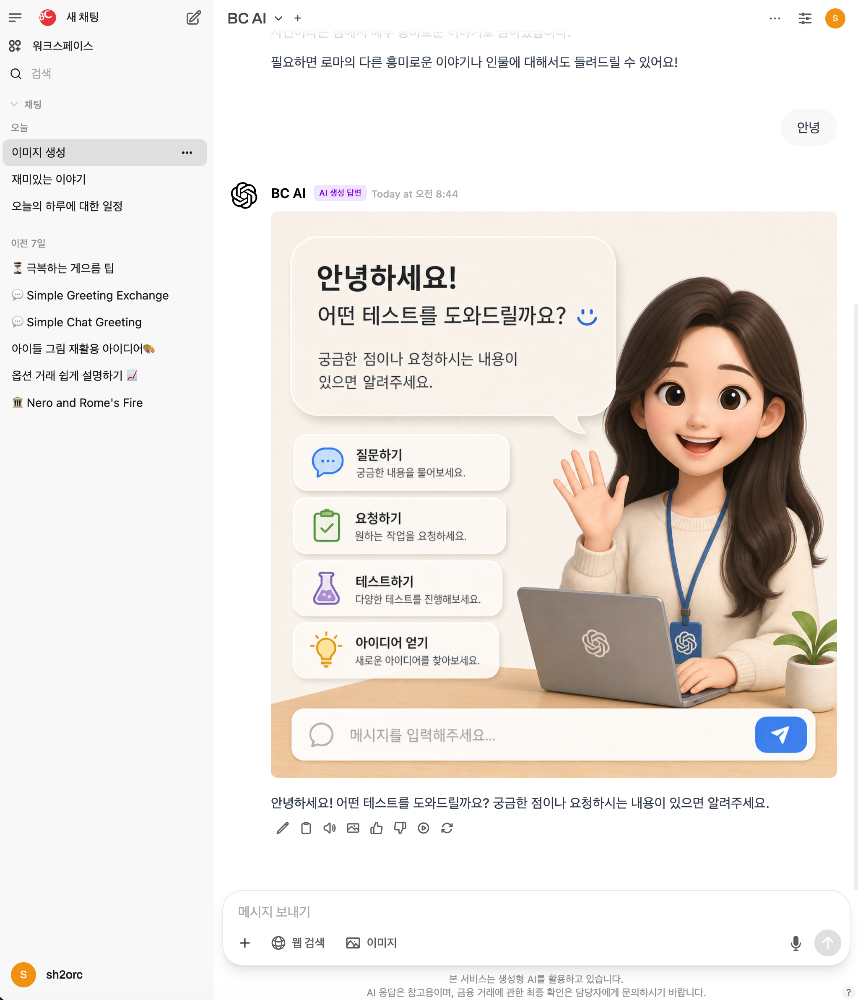
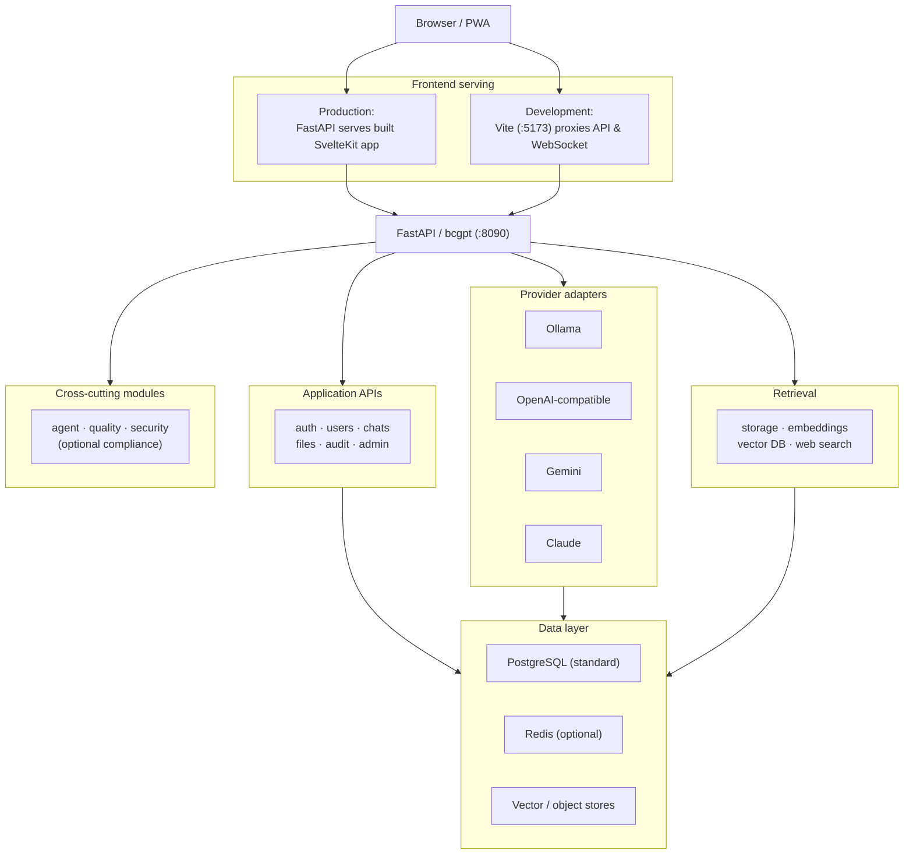

<div align="center">

# BCGPT WebUI

**채팅, 검색, 에이전트, 거버넌스를 위한 자체 호스팅 AI 워크스페이스**

[](LICENSE)

**언어**: [English](README.md) | [한국어](README_KR.md)

</div>



## 개요

BCGPT WebUI는 대형 언어 모델을 활용하기 위한 자체 호스팅 웹 애플리케이션입니다. SvelteKit 프론트엔드와 FastAPI 백엔드를 결합하여 로컬 Ollama 모델, OpenAI 호환 API, Gemini, Claude 연결을 지원합니다. 이 애플리케이션에는 채팅, 지식 베이스 및 검색, 웹 검색, 워크스페이스 자산, 에이전트 워크플로, 관리자 기능, 감사 뷰, 그리고 선택적 거버넌스 기능이 포함되어 있습니다.

Open WebUI v0.6.0에서 시작되었으며, 현재는 `bcgpt` Python 패키지와 Svelte 5 애플리케이션으로 유지보수되고 있습니다. 릴리스 이력은 [CHANGELOG.md](CHANGELOG.md)를, 업스트림 고지사항은 [NOTICE](NOTICE)를 참고하세요.

> [!IMPORTANT]
> BCGPT WebUI는 소프트웨어이며, 컴플라이언스 인증이나 모델 정확성 보증이 아닙니다. 고급 검색, 에이전트, 보안, FinOps, 컴플라이언스 기능은 사용되는 배포 환경에 맞게 활성화, 구성, 테스트 및 운영되어야 합니다. 많은 기능이 기본적으로 비활성화되어 있습니다.

## 목차

- [포함된 기능](#포함된-기능)
- [빠른 시작](#빠른-시작)
- [배포 옵션](#배포-옵션)
- [설정 및 운영](#설정-및-운영)
- [개발](#개발)
- [아키텍처](#아키텍처)
- [테스트 및 품질 검사](#테스트-및-품질-검사)
- [보안 정책](#보안-정책)

## 포함된 기능

### 채팅 및 워크스페이스

- 다중 프로바이더 채팅: 스트리밍 응답, Markdown/LaTeX 렌더링, 대화 기록, 폴더, 태그, 공유 링크, 채널, 메모리, 프롬프트 템플릿, 파일 업로드, PWA 자산을 지원합니다.
- Ollama, OpenAI 호환 API, Gemini, Claude용 서버 측 프로바이더. OpenAI 호환 엔드포인트는 호환 게이트웨이 및 모델 서버에 사용할 수 있습니다.
- 모델 정의, 지식 베이스, 프롬프트, 도구, 함수, 사용자, 그룹, 연결, 감사 데이터, 평가, RAG 관리를 위한 관리자 및 워크스페이스 화면.
- 각 프로바이더와 설정이 구성된 경우 이미지, 오디오, 작업, 파이프라인, 모델 관리 API 영역.

### 지식, 검색 및 웹 검색

- 파일 및 URL 수집, 지식 베이스 관리, 하이브리드 검색, 구성 가능한 임베딩 및 재순위 지정 모델, Qdrant, Milvus, pgvector, OpenSearch, Elasticsearch 벡터 저장소 지원.
- 선택적 검색 컴포넌트에는 HyDE, 쿼리 확장, step-back 프롬프팅, reciprocal-rank fusion, 규칙 기반 및 LLM 재순위 지정, CRAG, 문서 평가, 증거 조정, 멀티홉 검색, 부모/자식 청킹, 컨텍스트 검색, 의미 캐싱, 크로스 인코더 재순위 지정, GraphRAG, MMR, 수집 품질 점수 지정, 컬럼 프로파일링이 포함됩니다.
- Bing, Bocha, Brave, DuckDuckGo, Exa, Google Programmable Search, Jina, Kagi, Mojeek, Naver, Perplexity, SearchAPI, SearXNG, SerpApi, Serper, Serply, Serpstack, Tavily용 웹 검색 어댑터. 웹 검색을 사용하려면 프로바이더 자격 증명과 `ENABLE_RAG_WEB_SEARCH` 스위치가 필요합니다.

### 에이전트 및 품질 관리

- 세 가지 모델 자율성 수준: `suggest`, `assistant`, `operator`. operator 수준은 제한된 ReAct 스타일 도구 루프를 사용합니다.
- 10가지 노드 유형을 갖춘 DAG 워크플로 엔진: 사용자 입력, RAG 검색, 웹 검색, 컨텍스트 병합, 조건부, LLM 호출, API 호출, 텍스트 프로세서, PII 프로세서, 응답. 노드는 중지, 계속, 재시도, 폴백 오류 전략을 지원합니다.
- 멀티 에이전트 패턴: 순차, 병렬, 토론, 합의, 투표, Mixture of Agents(MoA), 위원회.
- 클레임 분해, 그라운딩, 문서 평가, 함의 점수 지정, 인용 감사, 환각 탐지를 위한 선택적 답변 품질 단계.

`MULTI_AGENT_ENABLED`와 `AGENT_QUALITY_PIPELINE_ENABLED`는 기본값이 `false`입니다. 워크플로 엔진은 기본적으로 활성화되어 있지만, 그 동작은 구성된 모델, 도구, 검색 및 웹 검색 서비스에 따라 달라집니다. 구현 세부사항 및 API 라우트는 [backend/bcgpt/agent/README.md](backend/bcgpt/agent/README.md)에 문서화되어 있습니다.

### ID, 보안 및 거버넌스

- 인증, 사용자 역할, 그룹, API 키, OAuth/OIDC, LDAP, 신뢰할 수 있는 헤더 SSO, TOTP MFA, RS256/JWKS JWT 서명, SCIM 2.0 프로비저닝이 코드베이스에 포함되어 있습니다. 개별 통합은 구성에 따라 다릅니다.
- CSRF 보호, 기본 보안 헤더, 속도 제한, 감사 로깅, 파일 서명 검증, 아웃바운드 페치를 위한 SSRF 방어, 구성 가능한 콘텐츠 및 모델 가드레일을 사용할 수 있습니다.
- 선택적 관리 기능에는 토큰/비용 추적 및 예산, 채팅 보존/익명화, AI 상호작용 감사 기록, AI 투명성 메시징, 긴급 정지, SIEM 웹훅 포워딩, 그리고 모델 인벤토리, 영향 평가, 승인 게이트, 인시던트, 공정성 테스트, RAG 출처, 데이터 주체 요청, 벤더 기록을 위한 컴플라이언스 모듈이 포함됩니다.

단지 기능이 존재한다고 해서 그것을 활성화하지 마세요. 먼저 설정, 데이터 보존 함의, 외부 종속성, 권한 부여 모델을 검토하세요. 특히 도구/함수 코드는 서버 프로세스의 권한으로 실행됩니다. 기본적으로 관리자만 작성할 수 있습니다. 적절한 운영체제 또는 컨테이너 격리 없이 `TOOLS_ALLOW_NON_ADMIN_CODE=true`를 설정하지 마세요.

## 빠른 시작

가장 빠른 로컬 배포는 BCGPT WebUI와 Ollama를 함께 시작합니다. Compose v2 플러그인이 포함된 Docker Desktop(또는 Docker Engine)이 필요합니다.

```bash
git clone https://github.com/bccard-ai/bcgpt-webui.git
cd bcgpt-webui

# 이 값은 안정적으로 유지하세요. 변경하면 기존 세션이 무효화됩니다.
export BCGPT_SECRET_KEY="$(python3 -c 'import secrets; print(secrets.token_urlsafe(32))')"

docker compose up -d --build
curl --fail http://localhost:8090/healthz
```

<http://localhost:8090>을 열고 초기 온보딩 흐름을 완료한 다음 모델을 구성하세요. 번들로 제공되는 Ollama 서비스는 모델을 자동으로 다운로드하지 않습니다. 명시적으로 하나를 내려받은 후 UI에서 모델 목록을 새로고침하세요.

```bash
docker exec -it ollama ollama pull <model-name>
```

이름이 지정된 Docker 볼륨 `bcgpt-data`와 `ollama-data`는 애플리케이션 데이터와 Ollama 모델을 보존합니다. 이 올인원 빠른 시작은 로컬 편의 프로필입니다. PostgreSQL 프로필을 표준 데이터베이스 배포 기준선으로 사용하세요. 컨테이너를 중지하거나 재생성해도 명시적으로 제거하지 않는 한 이 볼륨은 제거되지 않습니다.

## 배포 옵션

### Docker Compose 파일

| 파일                                                                    | 용도                                                | 서비스                          |
| ----------------------------------------------------------------------- | --------------------------------------------------- | ------------------------------- |
| [docker-compose.yml](docker-compose.yml)                                | 로컬 올인원 배포                                     | BCGPT WebUI, Ollama             |
| [docker-compose.without-ollama.yml](docker-compose.without-ollama.yml)  | 외부 모델 프로바이더 또는 원격 Ollama                | BCGPT WebUI                     |
| [docker-compose.with-db.yml](docker-compose.with-db.yml)                | PostgreSQL 및 Redis 배포를 위한 출발점               | BCGPT WebUI, PostgreSQL, Redis  |
| [docker-compose.dev.yml](docker-compose.dev.yml)                        | Docker 기반 핫 리로드 개발                           | Vite 프론트엔드, FastAPI 백엔드  |

모든 Compose 파일은 로컬 [Dockerfile](Dockerfile)을 빌드합니다. 런타임은 포트 `8090`에서 수신하고, 로컬 애플리케이션 데이터를 `/app/backend/data`에 저장하며, 프로세스 활성도 검사를 위해 `/healthz`를 노출합니다.

### 외부 프로바이더 또는 원격 Ollama

BCGPT WebUI가 자체 Ollama 컨테이너를 시작하지 않아야 하는 경우 standalone 프로필을 사용하세요.

```bash
export BCGPT_SECRET_KEY="$(python3 -c 'import secrets; print(secrets.token_urlsafe(32))')"
export OPENAI_API_KEY="replace-with-your-key"

docker compose -f docker-compose.without-ollama.yml up -d --build
```

원격 Ollama 서버의 경우, BCGPT 컨테이너에서 접근 가능한 주소를 제공하세요.

```bash
export BCGPT_SECRET_KEY="$(python3 -c 'import secrets; print(secrets.token_urlsafe(32))')"
export OLLAMA_BASE_URL="https://ollama.example.internal"

docker compose -f docker-compose.without-ollama.yml up -d --build
```

`OPENAI_API_BASE_URL`은 OpenAI 호환 서비스를 가리킬 수 있습니다. 여러 OpenAI 호환 또는 Ollama 연결을 위해 [.env.example](.env.example)에 문서화된 세미콜론으로 구분된 `OPENAI_API_BASE_URLS`/`OPENAI_API_KEYS` 및 `OLLAMA_BASE_URLS` 설정을 사용하세요.

### PostgreSQL 및 Redis

`with-db` 프로필은 완전한 프로덕션 런북이 아닌 유용한 출발점입니다. 데이터베이스 비밀번호가 필요하며 보안 세션 쿠키를 구성합니다.

```bash
export BCGPT_SECRET_KEY="$(python3 -c 'import secrets; print(secrets.token_urlsafe(32))')"
export POSTGRES_PASSWORD="replace-with-a-long-unique-password"

docker compose -f docker-compose.with-db.yml up -d --build
curl --fail http://localhost:8090/readyz
```

프로덕션 사용 전에 앱을 TLS 뒤에 배치하고, 비밀 관리자를 통해 안정적인 시크릿을 설정하고, 네트워크 액세스를 제한하고, 데이터베이스, 업로드, 벡터 데이터에 대한 백업/복원 절차를 선택하고, 비프로덕션 환경에서 업그레이드 및 롤백을 검증하세요.

### Kubernetes 및 Helm

저장소에는 [kubernetes/helm](kubernetes/helm) 아래에 Helm 차트가 포함되어 있습니다. 사용 전에 이미지, 시크릿, 스토리지, 프로브, 환경 설정을 검토하고 재정의하세요.

```bash
helm upgrade --install bcgpt ./kubernetes/helm \
  --set secrets.BCGPT_SECRET_KEY="replace-with-a-stable-secret"
```

적용하기 전에 차트를 렌더링하세요.

```bash
helm template bcgpt ./kubernetes/helm
```

차트 자체의 [README](kubernetes/helm/README.md)는 별도로 호스팅되는 차트 위치도 가리킵니다. 로컬 차트를 소스 제어되는 배포 구성으로 취급하고 운영하려는 차트/버전을 확인하세요.

### 수동 이미지 실행

```bash
docker build -t bcgpt-webui .
docker volume create bcgpt-data

docker run -d --name bcgpt \
  -p 8090:8090 \
  -e BCGPT_SECRET_KEY="$(python3 -c 'import secrets; print(secrets.token_urlsafe(32))')" \
  -v bcgpt-data:/app/backend/data \
  bcgpt-webui
```

`-e` 플래그로 프로바이더 자격 증명을 전달하거나, 바람직하게는 플랫폼의 시크릿 메커니즘을 사용하세요. [run-compose.sh](run-compose.sh)를 정규 배포 방법으로 사용하지 마세요. 이 파일은 현재 이 저장소에 없는 Compose 오버라이드 파일을 참조합니다.

## 설정 및 운영

### 핵심 설정

| 설정                                     | 용도                            | 운영 노트                                                                                                                                                             |
| ---------------------------------------- | ------------------------------- | --------------------------------------------------------------------------------------------------------------------------------------------------------------------- |
| `BCGPT_SECRET_KEY`                       | 세션 및 JWT 서명                | 인증이 활성화된 경우 필수입니다. 길고 무작위하며 안정적인 시크릿을 사용하세요.                                                                                          |
| `DATABASE_URL`                           | 기본 데이터베이스 URL           | PostgreSQL이 표준 배포 데이터베이스입니다. 코드는 이 값이 없을 때만 로컬/개발 호환성을 위해 `DATA_DIR`에 SQLite 폴백을 유지합니다.                                    |
| `OLLAMA_BASE_URL`                        | 하나의 Ollama 엔드포인트        | 올인원 Compose 프로필은 이것을 자체 `ollama` 서비스로 설정합니다.                                                                                                      |
| `OPENAI_API_KEY` / `OPENAI_API_BASE_URL` | OpenAI 또는 호환 API            | 여러 연결에는 복수형 URL/키 설정을 사용하세요.                                                                                                                         |
| `CORS_ALLOW_ORIGIN`                      | 허용되는 브라우저 출처          | 프론트엔드와 백엔드의 출처가 다를 때 명시적 출처를 구성하세요.                                                                                                         |
| `BCGPT_SESSION_COOKIE_SECURE`            | 보안 쿠키 플래그                | HTTPS 뒤에서 `true`로 설정하세요. 개발 실행기는 localhost HTTP에 대해 이를 재정의합니다.                                                                                |
| `RAG_FILE_MAX_SIZE`                      | 최대 업로드 크기(MB)            | 기본값은 `100`입니다.                                                                                                                                                  |
| `VECTOR_DB`                              | 검색 벡터 저장소 백엔드         | 기본값은 `qdrant`입니다. 필요한 경우 서비스/자격 증명을 별도로 구성하세요.                                                                                              |

[.env.example](.env.example)에는 의도적으로 제한된 주석이 달린 샘플이 포함되어 있습니다. 라이프사이클, 기본값, 프로바이더 설정, 스토리지, 관측 가능성, 기능 플래그를 포함한 전체 소스 기반 구성 카탈로그는 [.env.example](.env.example)에 문서화되어 있습니다.

많은 애플리케이션 값이 `PersistentConfig` 설정입니다. 환경 값은 초기 저장된 구성을 시드하고, 이후 관리자 변경 사항은 영속화됩니다. 환경 변경을 배포 입력으로 취급하고, 활성 런타임 값이라는 증거로 간주하지 마세요. 배포 후 관리자 UI 또는 관련 API를 통해 중요한 설정을 확인하세요.

### 헬스 및 API 엔드포인트

| 엔드포인트   | 의미                                                              |
| ------------ | ----------------------------------------------------------------- |
| `/health`    | 기본 애플리케이션 응답                                             |
| `/health/db` | 데이터베이스 쿼리가 포함된 기본 응답                               |
| `/healthz`   | 프로세스 활성도                                                    |
| `/livez`     | 데이터베이스 검사를 포함한 활성도                                  |
| `/readyz`    | 데이터베이스 및 구성된 벡터 저장소 검사를 포함한 준비도. Redis는 선택 사항 |

FastAPI의 대화형 API 문서(`/docs`)와 OpenAPI 문서(`/openapi.json`)는 `ENV=dev`인 경우에만 활성화됩니다. 정상적인 프로덕션 구성에서는 노출되지 않습니다.

### 보안 체크리스트

- 폐기 가능한 로컬 실험 외의 환경에서는 `BCGPT_AUTH=true`를 유지하고 모든 새 환경마다 고유한 `BCGPT_SECRET_KEY`를 생성하세요.
- 리버스 프록시 또는 로드 밸런서에서 TLS를 종료하고, 보안 쿠키 플래그를 설정하고, 백엔드 포트, 데이터베이스, Redis, 프로바이더 서비스에 대한 직접 액세스를 제한하세요.
- 신뢰할 수 있는 헤더 SSO를 사용하는 경우 `BCGPT_AUTH_TRUSTED_PROXY_IPS`를 실제 프록시 IP/CIDR로 설정하세요. 제한되지 않은 네트워크 경로에서의 ID 헤더를 신뢰하지 마세요.
- API 키, SCIM 토큰, OAuth/LDAP 자격 증명, 객체 저장소 자격 증명은 `.env` 파일에 커밋하는 대신 시크릿 매니저에 저장하세요.
- 사용자를 초대하기 전에 사용자 권한, 모델 액세스 규칙, API 키 제한, 도구/함수 작성, 웹 검색 액세스, 보존, 감사 로깅, 외부 통합을 검토하세요.
- 스테이징 환경에서 기능 플래그와 실패 모드를 테스트하세요. 일부 보안, 스캐너, 컴플라이언스, 품질, 관측 가능성 관리 기능은 옵트인되거나 배포별 종속성을 갖습니다.

지원되는 보안 보고 채널 및 프로젝트 정책은 아래의 [보안 정책](#보안-정책)을 참조하세요.

## 개발

### 로컬 개발

요구사항: Python 3.11+ 및 Bun 1.3+.

먼저 Bun을 설치하세요. macOS 또는 Linux에서는 Bun의 공식 설치기를 사용하세요.

```bash
curl -fsSL https://bun.com/install | bash
bun --version
```

Windows PowerShell에서는 `powershell -c "irm bun.sh/install.ps1|iex"`를 실행한 다음 새 터미널을 열고 `bun --version`으로 확인하세요. 패키지 매니저 및 플랫폼별 옵션은 [Bun 설치 가이드](https://bun.com/docs/installation)를 참조하세요.

Python 가상 환경을 생성하고 활성화한 다음 백엔드 요구사항을 설치하세요. 활성화된 환경은 개발 스크립트에서 사용하는 `python` 명령이 올바른 인터프리터로 연결되도록 합니다.

```bash
python3 -m venv .venv
source .venv/bin/activate
python -m pip install --upgrade pip
python -m pip install -r backend/requirements.txt
```

Windows PowerShell에서는 동일한 `python -m pip` 명령을 실행하기 전에 `py -3.11 -m venv .venv` 및 `.venv\Scripts\Activate.ps1`로 생성하고 활성화하세요.

프론트엔드 종속성을 설치하고 두 서비스를 모두 시작하세요.

```bash
bun install
bun run dev
```

이 명령은 필요한 Pyodide 자산을 가져오고, <http://localhost:5173>에서 Vite를 시작하며, <http://localhost:8090>에서 FastAPI 백엔드를 시작합니다. 개발 실행기는 필요시 백엔드 요구사항도 검사하고 설치하므로 자동 설정을 선호하는 경우 위의 명시적 Pip 단계를 건너뛸 수 있습니다. 또한 `node_modules/.cache` 아래에 안정적인 개발 서명 키를 생성하고, 백엔드 리로드를 활성화하며, Vite는 `/api`, `/ollama`, `/openai`, `/ws`를 백엔드로 프록시합니다.

개별 프로세스나 검사가 필요할 때는 다음 명령을 사용하세요.

```bash
# 프론트엔드 전용
bun run dev:frontend

# 백엔드 전용 (bun run dev에서 사용하는 것과 동일한 종속성/키 헬퍼 사용)
bun run dev:backend

# 정적 빌드 및 로컬 미리보기
bun run build
bun run preview
```

Docker 핫 리로드 프로필도 사용할 수 있습니다.

```bash
docker compose -f docker-compose.dev.yml up
```

### 프로젝트 구조

| 경로                  | 내용                                                                                 |
| --------------------- | ------------------------------------------------------------------------------------ |
| `src/`                | SvelteKit 애플리케이션, UI 컴포넌트, API 클라이언트, i18n 및 스타일                  |
| `backend/bcgpt/`      | FastAPI 애플리케이션, 모델, 라우터, 프로바이더, 검색, 에이전트, 보안 및 컴플라이언스 모듈 |
| `backend/bcgpt/test/` | 백엔드 단위 및 통합 테스트 스위트                                                     |
| `kubernetes/helm/`    | Helm 차트 소스                                                                        |
| `scripts/`            | 개발, 구성 인벤토리, 라우트 인벤토리 및 품질 헬퍼                                     |
| `docs/`               | 구성 참조, 운영 계획, 인벤토리 및 정책                                                |

## BCGPT에 기여하기

기여자 여러분, 환영합니다! BCGPT에 기여에 관심을 가져주셔서 감사합니다. 이 문서는 기여가 프로젝트를 효과적으로 향상시킬 수 있도록 과정을 안내합니다.

### 핵심 사항

#### Ollama vs. BCGPT

Ollama와 BCGPT를 구별하는 것이 중요합니다.

- **BCGPT**는 멀티 에이전트 오케스트레이션, 워크플로 자동화, 엔터프라이즈급 AI 기능을 갖춘 직관적이고 반응성이 뛰어난 채팅 상호작용용 웹 인터페이스를 제공하는 데 중점을 둡니다.
- **Ollama**는 로컬 모델 추론을 구동하는 기반 기술입니다.

이슈나 기여가 핵심 Ollama 기술과 직접 관련이 있는 경우, 적절한 [Ollama 프로젝트 저장소](https://ollama.com/)로 보내주세요. BCGPT의 저장소는 웹 인터페이스와 백엔드 서비스 전용입니다.

#### 이슈 보고

이상한 점을 발견하셨나요? 아이디어가 있으신가요? [이슈 탭](https://github.com/bccard-ai/bcgpt-webui/issues)을 확인하여 이미 보고되었거나 제안되었는지 확인하세요. 그렇지 않다면 새 이슈를 열어 주세요. 이슈를 보고할 때는 이슈 템플릿을 따라주세요. 이 템플릿은 처음부터 모든 필요한 세부 정보가 제공되도록 설계되었으며, 귀하의 우려 사항을 더 효율적으로 해결할 수 있습니다.

> [!IMPORTANT]
>
> - **템플릿 준수:** 제공된 이슈 템플릿을 따르지 않거나 요청된 정보를 전혀 제공하지 않으면 이슈가 추가 검토 없이 종료될 가능성이 높습니다. 이 접근 방식은 이슈 추적의 관리 가능성과 무결성을 유지하는 데 중요합니다.
> - **세부 정보가 핵심입니다:** 이슈가 이해되고 효과적으로 해결될 수 있도록 포괄적인 세부 정보를 포함하는 것이 필수적입니다. 설명은 명확해야 하며, 재현 단계, 예상 결과 및 실제 결과를 포함해야 합니다. 충분한 세부 정보가 없으면 이슈 해결 능력이 저해될 수 있습니다.

#### 지원 범위

BCGPT와 직접 관련이 없는 이슈, 특히 Docker 설정과 관련된 이슈가 증가하고 있음을 알았습니다. Docker 배포를 지원하기 위해 노력하지만, 원활한 경험을 위해서는 Docker 기본 사항을 이해하는 것이 중요합니다.

- **Docker 배포 지원**: BCGPT는 Docker 배포를 지원합니다. Docker에 대한 기본 지식이 있다고 가정합니다. Docker 기본 사항은 [공식 Docker 문서](https://docs.docker.com/get-started/overview/)를 참조하세요.

- **고급 구성**: HTTPS를 위한 리버스 프록시 설정 및 Docker 배포 관리에는 기초 지식이 필요합니다. 이러한 기술을 배울 수 있는 수많은 온라인 리소스가 있습니다. 이 지식을 갖추면 BCGPT 및 유사한 프로젝트에 대한 경험이 크게 향상됩니다.

### 기술 스택 (v2.0)

BCGPT v2.0은 다음 스택을 사용합니다. 기여하기 전에 익숙해지세요.

#### 프론트엔드

- **Svelte 5** - runes(`$state`, `$derived`, `$effect`, `$props`) 사용. 기존 `export let` / `$:` 구문은 더 이상 사용되지 않습니다.
- **SvelteKit** - 라우팅 및 SSR용
- **Tailwind CSS v4** - `@import 'tailwindcss'` 및 `@tailwindcss/postcss` 사용
- **TypeScript 5.9+** - strict 모드
- **Vite 6** - 빌드 도구

#### 백엔드

- **Python 3.11+** - FastAPI 포함
- **bcgpt** 패키지 - `agent/`, `providers/`, `utils/` 모듈 포함
- **Pydantic v2** - 데이터 검증용

#### 테스트 및 품질

- **Vitest 4** - 프론트엔드 단위 테스트용
- **Cypress** - E2E 테스트용
- **ESLint 10** + **Prettier** - 코드 포맷팅용
- **Ruff** - Python 린팅용

- **pytest** - 백엔드 단위 테스트용. `backend/bcgpt/test/unit/`의 빠르고 종속성이 적은 테스트 (실행: `cd backend && python -m pytest bcgpt/test/unit/ -v`). 현재 보안 스캐너, 인증/JWT, RAG 컴포넌트, 품질 파이프라인을 포함한 232개의 백엔드 단위 테스트가 있습니다.

### 기여

기여하고 싶으신가요? 도움을 주는 방법은 다음과 같습니다.

#### 풀 리퀘스트

풀 리퀘스트를 환영합니다. 제출하기 전에 다음을 수행해 주세요.

1. [여기](https://github.com/bccard-ai/bcgpt-webui/discussions/new/choose)에서 아이디어에 대한 논의를 여세요.
2. 프로젝트의 코딩 표준을 따르고 새 기능에 대한 테스트를 포함하세요.
3. 필요에 따라 문서를 업데이트하세요.
4. 명확하고 설명적인 커밋 메시지를 작성하세요.
5. 적시에 풀 리퀘스트를 완료하는 것이 중요합니다. 우리는 빠르게 움직이며, PR이 너무 오래 방치되는 것은 불가능합니다. 합리적인 시간 내에 완료할 수 없는 경우, 프로젝트를 계속 진행하기 위해 종료해야 할 수 있습니다.

##### Svelte 5 가이드라인

프론트엔드 코드 작업 시:

- 기존 반응형 선언(`$:`, `export let`) 대신 **runes**(`$state`, `$derived`, `$effect`, `$props`)를 사용하세요.
- 컴포넌트 구성을 위해 슬롯 대신 적용 가능한 경우 `{#snippet}` 및 `@render`를 사용하세요.
- 기존 컴포넌트에 설정된 패턴을 따르세요. 관례는 주변 파일에서 확인하세요.
- 모든 새 컴포넌트는 반드시 Svelte 5 runes 구문을 사용해야 합니다.

##### 백엔드 가이드라인

백엔드 코드 작업 시:

- 백엔드는 `backend/bcgpt/` 아래에 구성되어 있습니다.
- 새 프로바이더는 `providers/`에, 새 에이전트 기능은 `agent/`에 추가하세요.
- 모든 API 스키마에 Pydantic v2 모델을 사용하세요.
- 코드베이스의 기존 async 패턴을 따르세요.

#### 문서 및 튜토리얼

문서 개선, 튜토리얼 작성, 또는 웹 UI 설정 및 최적화에 대한 가이드 생성을 통해 BCGPT를 더 쉽게 접근할 수 있도록 도와주세요.

#### 번역 및 국제화

BCGPT를 더 넓은 청중에게 제공하도록 도와주세요. 번역 저장을 위해 JSON 파일을 사용합니다. 기존 번역 파일은 `src/lib/i18n/locales` 디렉토리에서 찾을 수 있습니다. 각 디렉토리는 특정 언어에 해당합니다. 예를 들어 `en-US`는 미국 영어, `fr-FR`은 프랑스어(프랑스) 등입니다. 특정 언어의 적절한 코드를 찾으려면 [ISO 639 언어 코드](http://www.lingoes.net/en/translator/langcode.htm)를 참조하세요.

새 언어를 추가하려면:

- 적절한 언어 코드를 이름으로 사용하여 `src/lib/i18n/locales` 경로에 새 디렉토리를 생성하세요. 예를 들어 스페인어(스페인) 번역을 추가하는 경우 `es-ES`라는 새 디렉토리를 생성합니다.
- 미국 영어 번역 파일(`src/lib/i18n/locale`의 `en-US` 디렉토리에서)을 이 새 디렉토리로 복사하고 언어에 따라 JSON 형식의 문자열 값을 업데이트하세요. JSON 객체의 구조를 보존해야 합니다.
- 언어 코드와 해당 제목을 `src/lib/i18n/locales/languages.json`의 언어 파일에 추가하세요.

#### 질문 및 피드백

질문이나 피드백이 있으신가요? 이슈를 열어 주세요. 도움을 드리겠습니다!

### 감사합니다!

귀하의 기여는 크든 작든 BCGPT에 중대한 영향을 미칩니다. 귀하가 프로젝트에 가져올 것을 보게 되어 기대됩니다!

## 아키텍처

빌드된 애플리케이션은 프로덕션에서 FastAPI 프로세스에 의해 서빙됩니다. 별도의 Node 서버가 아닙니다. 로컬 개발은 Vite를 프론트엔드 개발 서버로 사용하고 백엔드 트래픽을 FastAPI로 프록시합니다.



## 테스트 및 품질 검사

저장소 루트에서 다음 명령을 실행하세요.

```bash
# 프론트엔드 테스트, Svelte 진단 및 린트 검사
bun run test:frontend
bun run check
bun run lint:frontend:check

# 백엔드 단위 테스트
make test-backend-unit

# 결합된 기본 테스트 타겟
make test

# 소스 기반 인벤토리 및 회귀 검사
bun run check:routes
bun run check:ratchet
bun run check:fetch
make config-inventory
```

`make test-backend-integration`은 Docker/PostgreSQL 통합 환경이 필요합니다. `make test-backend-integration-collect`는 수집만 수행합니다. 문서 또는 프론트엔드 변경 사항을 제출하기 전에 `bun run format:check`를 사용하고, 구성된 파일 세트 전체에 포맷팅 변경 사항을 적용하려는 경우에만 `bun run format`을 사용하세요.

## 보안 정책

당사의 주요 목표는 사용자가 BCGPT에 저장한 민감한 데이터의 보호와 기밀성을 보장하는 것입니다.

### 지원 버전

| 버전    | 지원 여부            |
| ------- | -------------------- |
| 2.x     | :white_check_mark:   |
| 1.x     | :x:                  | 
| 기타    | :x:                  |

### 취약점 보고

BCGPT WebUI를 안전하게 유지해주셔서 감사합니다. 보안 연구자, 개발자, 그리고 일상적으로 문제를 제보해주시는 모든 사용자분들이 프로젝트를 더욱 강력하게 만들어주며, 여러분의 모든 기여에 진심으로 감사드립니다. 완벽하게 문서화된 개념 증명(PoC)이든, 단순히 무언가 이상하게 보인다는 발견이든, 여러분의 의견을 듣고 싶습니다.

문제를 최대한 빠르게 분류하고 수정할 수 있도록, 다음 정보를 가능한 한 많이 포함해 주세요.

1. **명확한 설명**: 무엇을 관찰하셨으며, 예상했던 동작은 무엇이었나요? 대략적인 설명이라도 훌륭한 출발점이 됩니다.

2. **재현 단계**: 자세할수록 문제를 더 빨리 확인할 수 있습니다. 스크린샷, 요청/응답 예시, 로그 모두 환영합니다.

3. **영향받는 컴포넌트**: 라우트, 엔드포인트, 파일 또는 기능을 알려주시면 시간을 절약하고 수정 범위를 파악하는 데 도움이 됩니다.

4. **잠재적 영향**: 누가 영향을 받고 얼마나 심각한지에 대한 의견은 우선순위를 정하는 데 도움이 됩니다.

5. **개념 증명(선택 사항이지만 환영)**: PoC, 최소 예제, 또는 유지관리자와 공유한 비공개 포크는 매우 유용합니다. 가지고 계시다면 포함해 주세요. 없더라도 괜찮습니다 — 충분한 설명만으로도 큰 도움이 됩니다.

6. **수정 제안(선택 사항)**: 수정에 대한 아이디어가 있으시다면 듣고 싶습니다. 패치, 풀 리퀘스트, 짧은 글이라도 당사가 더 빠르게 대응하는 데 도움이 됩니다.

모든 보고서는 성의를 갖고 검토하며, 최대한 신속하게 답변드리겠습니다. 명확하지 않은 부분이 있으면 보고를 기각하지 않고 질문을 통해 다시 연락드릴 것입니다 — 당사의 목표는 문제를 해결하기 위해 여러분과 함께 협력하는 것입니다.

민감한 보고서이거나 공개 이슈 트래커를 사용하고 싶지 않은 경우, 저장소에 나열된 어떤 연락 채널을 통해서든 유지관리자에게 연락하셔도 좋습니다. 보고서가 위 기준을 충족하는 경우, 우리는 이를 다른 고품질 풀 리퀘스트와 동일하게 취급하고 신속하게 수정 사항을 병합하기 위해 노력합니다.

### 제품 보안

당사는 자동화 및 수동 테스트 기술의 조합을 사용하여 취약점에 대해 내부 프로세스 및 시스템 아키텍처를 정기적으로 감사합니다. 또한 CI 파이프라인의 일부로 SAST 및 SCA 스캔을 수행합니다.

취약점을 보고하거나 보안 우려 사항을 공유하려면 [이슈 트래커](https://github.com/bccard-ai/bcgpt-webui/issues)에 이슈를 생성해 주세요. 제출된 내용은 신중하게 검토하며, 모든 사용자를 위해 BCGPT WebUI를 더 안전하게 만드는 모든 기여에 감사드립니다.

---

_최종 업데이트: **2026-07-29**._

## 라이선스 및 저작권 표시

BCGPT WebUI는 [Apache License 2.0](LICENSE)에 따라 라이선스됩니다. 이 프로젝트는 [Open WebUI](https://github.com/open-webui/open-webui) v0.6.0에서 시작되었습니다. 필수 업스트림 고지사항은 [NOTICE](NOTICE)에 보존되어 있습니다.
